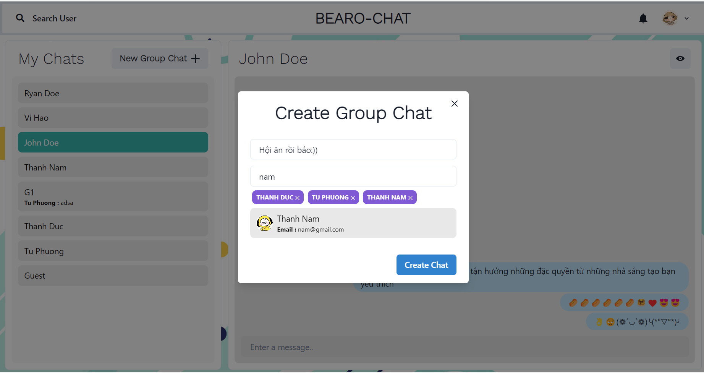

# CHAT_WEB
## ⭐ Introduction

Bearo chat application allows users to make friends, get to know each other, and have heart-to-heart conversations to share information with each other through cyberspace with many new friends. You can completely make friends, chat, and share stories, confide or discuss issues in life with anyone in the Bearo app that we cannot share with anyone in real life.

##  🤝 Experiments
### 1. Sign up & Sign in

 
### 2. Chat

## ⭐ Future Features

-   Pending

_Feel free to fork and contribute to include these features._ ❤︎

## 🚀 Technologies

 Programming tools and languages used:
  -   Database management system: Cloudinary, MongoDB.
  -   Programming tools: Visual Studio Code.
  -   Programming language & Frameworks: Javascript, HTML, CSS, React, Node.js, Websocket.

## 🤝 Contribute

To contribute, fork the repository and push the changes to the **master** branch. Then submit a pull request for merging with the source. If your code passes the review and checks it will be merged into the master branch.

## 💬 Feedback

Feel free to send us feedback on [Gmail] Feature requests are always welcome.

## 📝 License

Licensed under the [MIT License].
